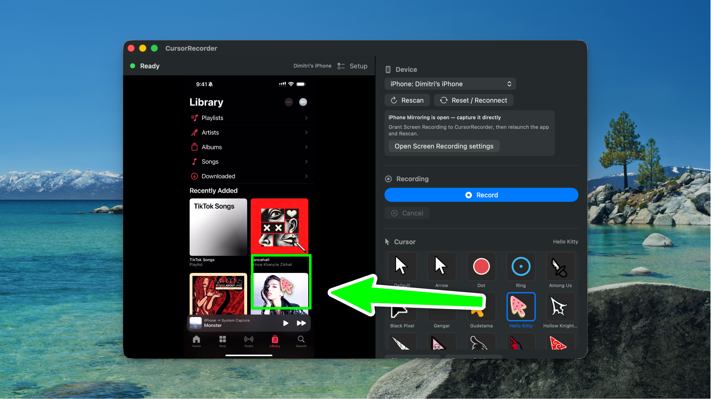

# Cursor Recorder

A native macOS (SwiftUI) recorder for app demos, gameplay, product videos, iPhone
Mirroring, iOS Simulator, individual Mac windows, and USB-connected phones. It exports a
one-click MP4 with a custom, Mac-controlled cursor overlay.



- **Mac windows** via ScreenCaptureKit — record a selected app window with the same
  custom cursor overlay used for phone captures.
- **iPhone (USB)** capture via AVFoundation — the trusted, USB-tethered iPhone screen
  source, exposed by enabling CoreMediaIO screen-capture devices.
- **iPhone Mirroring & iOS Simulator** capture via ScreenCaptureKit — record the window
  wirelessly; drive the phone in Apple's Mirroring window and your cursor renders on top.
- **Android (USB)** capture via Homebrew-installed `scrcpy` + `adb`.
- A visual gallery of cursors (built-in pack + an imported gaming pack, or your own PNGs),
  with scale, opacity, shadow, smoothing, and hotspot controls.
- A menu bar controller for starting, stopping, canceling, revealing the last recording,
  switching quality, and optionally running without a Dock icon.

Target: macOS 14+. Universal (Apple Silicon + Intel).

## Download

Grab the latest signed and Apple-notarized build from
**[Releases](https://github.com/dimitriharding/cursor-recorder-mac-app/releases/latest)**:

1. Download `Cursor-Recorder-1.0.1-macOS.zip`, unzip, and move **Cursor Recorder.app** to Applications.
2. Double-click to open. The release is signed with Developer ID and notarized by Apple, so Gatekeeper should allow it without a security override.
3. Grant **Screen Recording** (for iPhone Mirroring / Simulator) and **Camera/Microphone**
   (for the USB iPhone source) when prompted, then relaunch.

> Requires macOS 14 or later.

## Build from source

The Xcode project is generated from `project.yml` with [XcodeGen](https://github.com/yonyz/XcodeGen):

```bash
brew install xcodegen          # if not already installed
xcodegen generate              # creates CursorRecorder.xcodeproj
open CursorRecorder.xcodeproj
```

Or from the command line:

```bash
xcodebuild -project CursorRecorder.xcodeproj -scheme CursorRecorder \
  -configuration Debug -destination 'platform=macOS' build
```

First launch will ask for **Camera** and **Microphone** permission (needed to read the
iPhone capture source). The app runs **without** the App Sandbox in V1 so it can launch
Homebrew tools and write to a user-selected output folder.

On first launch a **Setup checklist** appears (reopenable anytime via the **Setup** button
in the status bar). It shows live status for Camera/Microphone permission, a
connected/ready phone, and the optional Android tooling — each with a one-tap action
(Grant, Open Settings, Rescan, or the Homebrew install command to copy).

> **Run it from Xcode the first time.** macOS ties Camera/Microphone permission to the
> app's code signature; building and running through Xcode (with your dev team) gives it a
> stable identity so the permission grant sticks. The app also auto-rescans when a phone is
> plugged in/unplugged, retries iPhone discovery for a few seconds after launch, and turns
> a mid-recording disconnect into a clear error.

## Android tooling

V1 does not bundle Android tools. Install them with:

```bash
brew install scrcpy android-platform-tools
```

The app auto-detects `scrcpy`/`adb` in `/opt/homebrew/bin` and `/usr/local/bin` (and via
`which`). If they are missing the UI shows the install command. Enable **USB debugging** on
the device and authorize this Mac when prompted.

## How it works

| Area | File |
|------|------|
| Models / state machine | `Models/CoreTypes.swift` |
| Tool & USB detection | `Capture/ToolLocator.swift`, `Capture/USBDetector.swift` |
| iPhone source enablement | `Capture/CoreMediaIOEnabler.swift` |
| Capture boundary | `Capture/PhoneCaptureAdapter.swift` |
| iPhone capture | `Capture/IPhoneUSBCaptureAdapter.swift` |
| Window / iPhone Mirroring / Simulator capture | `Capture/MirroringCaptureAdapter.swift` |
| Android capture | `Capture/AndroidScrcpyCaptureAdapter.swift` |
| Live cursor compositing | `Cursor/CursorRenderer.swift` |
| Telemetry | `Cursor/CursorTelemetryRecorder.swift` |
| Direct MP4 writer (iPhone) | `Recording/FrameCompositorWriter.swift` |
| Post-process compositor (Android) | `Recording/VideoCompositor.swift` |
| Orchestration | `Recording/RecordingCoordinator.swift` |
| UI | `Views/ContentView.swift`, `Views/PhonePreviewView.swift`, `Views/SetupChecklistView.swift` |

### Custom cursors

There are three ways to use your own cursor:

1. **Built-in pack** — Arrow, Dot, Ring, plus a gaming cursor pack (Among Us, Hollow
   Knight, Gengar, Solo Leveling, Miles Morales, etc.) imported from the
   [OpenScreen](https://github.com/siddharthvaddem/openscreen) project
   (`public/cursors/*/arrow.png`). They live in `CursorRecorder/Resources/Cursors/` and
   are discovered automatically at runtime — drop more PNGs there to extend the built-in
   list.
2. **Choose PNG…** — pick any transparent PNG from disk for a one-off cursor.
3. **Cursor folder** — click **Cursor folder…** to open
   `~/Library/Application Support/Cursor Recorder/Cursors`. Drop transparent PNGs in
   there and they appear in the cursor picker automatically (the cursor-pack mechanism).

Use the **Hotspot X/Y** sliders to set the cursor's click point (where the pointer
actually "is" inside the image) — e.g. the tip of an arrow is roughly (0.05, 0.03), a
reticle is (0.5, 0.5). Scale, opacity, smoothing, and drop-shadow are adjustable too, and
all cursor settings + the output folder persist between launches.

### Cursor mapping

The pointer position inside the preview's aspect-fit rectangle is normalized to source
video coordinates (top-left origin), recorded with timestamps, and composited so the
cursor's hotspot lands on that point — consistent for window captures, iPhone Mirroring,
Simulator, and portrait or landscape phone sources in both the live preview and exported
MP4.

## V1 notes / limitations

- Android's live image is shown in scrcpy's own mirror window; the in-app preview is an
  aspect-correct cursor canvas (no embeddable scrcpy video surface on macOS).
- iPhone capture requires a Mac/macOS/device combination that exposes the iPhone as a
  capture source (the same mechanism QuickTime uses). If it isn't exposed, the app shows an
  explicit unsupported/waiting-for-trust state.
- The GitHub release build is signed with Developer ID, notarized by Apple, and stapled.
